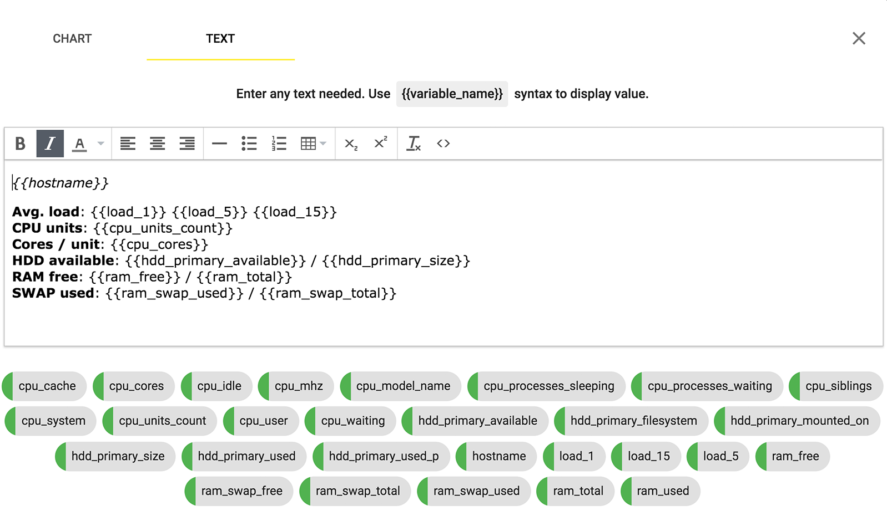

At Trafikito you can monitor the <wiki>output</wiki> of any <wiki>commands</wiki> available on your Linux server. 

During installation, Trafikito <wiki>agent</wiki> tries to detect basic available commands and generate an <wiki>initial dashboard</wiki> for you automatically. 

<info>You can make desired changes to the default <wiki>dashboard</wiki> as it is very flexible.</info>

<!--more-->

<gif></gif>

Default View
------------

The default view will contain:

1.  Hostname and overview of main resources: Disk space, RAM, CPU
2.  Detailed average load logs over time
3.  Detailed disk space, RAM and CPU logs over time
4.  Several text boxes with a more detailed overview of the disk space, RAM, and CPU at the moment

Desktop and Mobile Layouts
--------------------------

The mobile and desktop <wiki>layouts</wiki> are different. 

The default view on mobile devices will appear as columns of boxes. So, you will need to enter the <wiki>Edit Mode</wiki> on your mobile device in order to drag around & resize the boxes for the mobile view.

<info>While dragging on a mobile is a little harder, you can just narrow the window of your browser on the desktop <wiki>to view mobile layout</wiki> and edit it on the desktop too.
</info>

Edit Mode
---------

You can switch to the <wiki>Edit Mode</wiki> and make your desired changes to everything, at any given time.

You can <wiki>add a new block</wiki>, drag around and resize the existing ones. 

You can <wiki>change the contents</wiki> of anything and switch a block type <wiki>from text to chart</wiki> or chart to text. 

You can change the <wiki>line colors</wiki> of the charts, the title, set the default visibility of the series and the minimum or maximum range of the y-axis. 

You can <wiki>use custom text</wiki> together with <wiki>variables</wiki> for all settings.

<gif></gif>

Chart vs. Text Blocks
---------------------

Every block may contain <wiki>text or a chart</wiki>. 

In the <wiki>Edit Mode</wiki>, you can switch between modes of the block. Currently, you can choose between chart or text but there will be more modes available down the line. 

In order to have custom auto-updating titles like <code>RAM free: 1008.91 MB</code> you can use <wiki>variables</wiki> in any settings of a chart or in a text.

You will always find all of your <wiki>variables</wiki> in <wiki>settings</wiki>. 

The color next to the variable indicates if its value is in the <range-normal>normal</range-normal>, <range-warn>warn</range-warn> or <range-error>error</range-error> ranges.

<gif></gif>

Working with a Team
-------------------

The <wiki>dashboard</wiki> is visible for all active <wiki>members</wiki> of the <wiki>workspace</wiki>. 

When boxes are updated, updates are visible for all, in both the desktop and mobile <wiki>layouts</wiki>. 

<info>
As a general practice, we recommend giving a minimum specified role to each member of a team to prevent accidents. You can always make changes to the user roles in the workspace settings.
</info>

