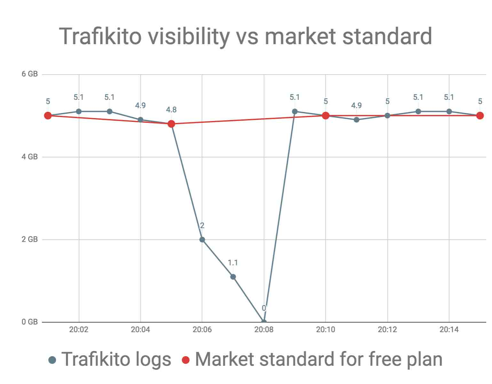

Trafikito logs data every minute while the market standard for free plans is 5-15 minutes interval. Why is this important for you? 

As an example let’s take a common scenario of a failed backup <wiki>cron job</wiki> (_an automatically scheduled task_). 

<!--more-->

1. The backup started at 20:04 but after 4 minutes the disk ran out of space. 
2. At 20:08 the application crashed and was left in an unresponsive state. 
3. The <wiki>cron job</wiki> cleaned itself and disk space was available again but the damage was already done because the main application was left in a broken state. 

<quote>With 5-15 minutes intervals, you would not see what happened. Trafikito solves this problem because it gives better visibility for all plans.</quote>

The Free and Paid plans offer high-quality logs for everyone
------------------------------------------------------------

Trafikito <wiki>receives log</wiki> data every single minute. While, the market standard is usually 5, 10 or 15 minutes, especially for <wiki>free plans</wiki>. This means that when you see statistical data every 5 minutes, it's an average of that 5 minutes and if there was an issue in that period of time, then you will not see it. 

So for instance, if a backup is running 3 minutes and it eats all of your resources, which causes your **Node.js** application to become frozen, you will not see such data without 1-minute density.

You can clearly see the need to have more visibility with logs of every single minute. 

Trafikito solves this issue, as it possesses a higher density of logs. 

<info>Your mind can be at ease because Trafikito provides 1-minute density for **all** <wiki>plans</wiki>. Including free.</info>

How many logs will be available for you to browse?
--------------------------------------------------

The Free plan offers **24 hours** of visibility. Which is totally fine for hobby projects or if you react quickly after getting a <wiki>notification</wiki>. 

However, if you want to debug all that occurred over the weekend after you return to the office on Monday; then you will need 3 days of visibility.

Often this is the situation when the update is pushed on Friday morning, everything seems OK but on Monday you notice that your servers were overloaded by some random backup <wiki>cron job</wiki>. 

The most suitable plans to prevent an issue like this would be the <wiki>Medium plan</wiki> that offers 1 week of visibility as an extra premium feature or the <wiki>Roarr</wiki> plan that gives 2 weeks of coverage which is more than enough for any outage.

Notifications
-------------

Trafikito <wiki>notifications</wiki> are <wiki>API calls</wiki> when something happens. 

Something is defined with <wiki>when cases</wiki>.

For example, if you want to <wiki>get an email</wiki> when:
 1. <code>free\_ram</code> is in <range-error>error range</range-error> (e.g. 0-100MB) for 5 minutes
 2. When the same variable is in the <range-warn>warning range</range-warn> for 15 minutes. 
 
<info> You can combine several <wiki>when cases</wiki> and when any of these becomes true, then an <wiki>API call</wiki> will be executed. Default API call will send notification over the email.
</info>

The market standard is to give notifications only for paid plans and most of the time only in the form of an email but Trafikito goal is to provide more. There is close to no value from monitoring if you don’t get notifications when something happens.

With the free plan you can get up to 100 notifications triggers per 24 hours and 30 ‘_when cases_’ per server. Paid plans [get more](https://trafikito.com/price).

Data sources
------------

Trafikito runs <wiki>commands</wiki> on the server and collects output. 

Each running <wiki>command</wiki> is a <wiki>data source</wiki>. 

So if you want to track an average load, you can use <code>uptime</code> command which is one data source. 

To get RAM information, the popular command is <code>free -m</code> and this is another data source. 

<info>
With the <wiki>free plan</wiki>, you can have up to 11 <wiki>data sources</wiki> which should be enough for any hobbyist. On the other hand, the Paid plans allow you to add more data sources.
</info>

Total output size
-----------------

The <wiki>commands</wiki> from <wiki>data sources</wiki> return output. Some commands may return in a single number, while some may return as a full page of text.
 
 Whichever format it returns in, you can always optimize an output length by writing <wiki>custom commands</wiki> on your server. 
 
 The total <wiki>output size</wiki> limits are the number of bytes that can be sent to Trafikito in total at once. 
 
 <quote>
 The <wiki>Free plan</wiki> can send 3.3KB of data every minute, Start plan is 3.8KB, Medium is 5.8KB and Roarrr is 7.8KB of data. Check <wiki>pricing</wiki> page for up to date numbers.
 </quote>
  
 In most cases, the <wiki>default configuration</wiki> will eat ±2KB of this data but you can always change it to whatever makes the most sense for you.
 
 Though, the Actual size depends on your machine and commands in use. So, some commands return more data and some less.

If you are on a <wiki>Medium plan</wiki> and have 15 <wiki>data sources</wiki> and all of them combined tries to send more than 3.8KB of data, Trafikito will replace the biggest <wiki>output</wiki> with a message about it. The message will be available in the <wiki>sample output</wiki> of the <wiki>command</wiki> in <wiki>server settings</wiki>.

Support
-------

Support is important for any product. At the moment we offer support by:

1.  Email
2.  Facebook Messenger

Members management
---------------

When <wiki>working with a team</wiki>, Trafikito allows you to assign member <wiki>roles</wiki> for each member. 

We recommend assigning an admin role only if you need someone else to setup your environment but when the setup is done, its best to downgrade the member to a _member_ <wiki>role</wiki>. 

This will ensure that no accidental edits are made by anyone from the team.

The <wiki>Free plan</wiki> is great for individuals and It allows a single member in a <wiki>workspace</wiki> for free. 

However, if you want to work together with up to 5 members, you will require the <wiki>Start plan</wiki>. Though, to assign <wiki>member roles</wiki> you would need to upgrade to the <wiki>Medium</wiki> or <wiki>Roarr</wiki> plans.

If you want to make sure some members can only see logs but not modify anything. The <wiki>Medium plan</wiki> offers 15 members in a workspace, which should be plenty for most. While the <wiki>Roarr plan</wiki> will give double the amount which is 30 members per <wiki>workspace</wiki>.

Server management
-----------------

You can be an active <wiki>member</wiki> of as many <wiki>workspaces</wiki> as you need with the same account. It’s very convenient to see if everything is in good shape for all servers, especially If you have several of them running at the same time. Starting with a <wiki>free plan</wiki> for one <wiki>workspace</wiki>, you can add up to 10 servers to monitor. Respectively, paid plans allow you to add more servers per <wiki>workspace</wiki>. View <wiki>pricing</wiki> for more up to date details.

Main differences between the plans
----------------------------------

At Trafikito we try to keep things simple. Including <wiki>price</wiki>. You can choose to use Trafikito with a <wiki>free plan</wiki> or pick 1 of 3 paid plans. The main differences between the plans are:

1.  The number of logs that are available for you to browse in the history.
2.  The number of <wiki>members</wiki> that you can have in the company and the specific <wiki>roles</wiki> for these members.
3.  The number of <wiki>servers</wiki>, <wiki>notifications</wiki> and <wiki>data sources</wiki> that are required.
4.  The total <wiki>output size</wiki>.

You can always see up to date pricing information at <wiki>pricing</wiki> page.

Conclusion
----------

Trafikito’s goal is to provide **great service to everyone** and it is not our goal to eventually offer only paid services to our users. This will never happen. Trafikito can successfully run businesses with only 1% of paid users and this is why even the free plan is great. Trafikito is built on <wiki>AWS</wiki> <wiki>infrastructure</wiki> and can easily work with  unlimited users.

In general, you will only need the <wiki>paid plans</wiki> if you need to have several members in the same <wiki>workspace</wiki> or you have many servers that you want to monitor and see the history of <wiki>logs</wiki>.