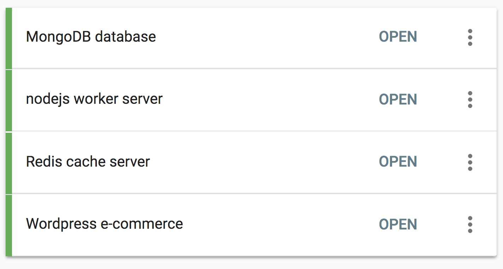
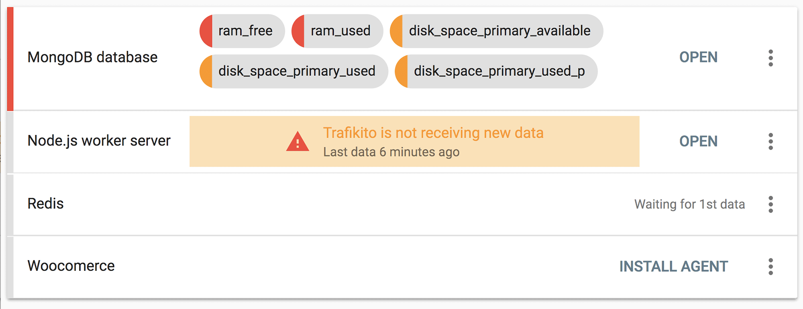

With Trafikito you can monitor many Linux servers at once and organize them into workspaces. Even with the free plan, a single workspace can hold up to 10 servers. The servers list is automatically refreshed every 30 seconds, so you can keep it open on a separate screen to always see the overview of your machines.

<!--more-->

The servers list is an overview of everything you have
------------------------------------------------------

In the servers list you can:

*   See if all servers are running smoothly
*   See if all servers are up and sending data to Trafikito
*   See if Trafikito agent is already installed and waiting for the 1st data to come
*   Get instructions how to install or uninstall Trafikito agent from your server

While you can do and see a lot, you will notice that the interface is clean and there’s no visual noise. If everything with the server is great - you will just see the server name with a green status on the left.

<gif></gif>

If something is going wrong, you will immediately notice. You can hover over any variables to see details and click “Open” to dive into the full dashboard for the selected server.

<gif></gif>

Conclusion
----------

The servers list is the first stop to an overview of all your machines at once. You can see immediately if everything is fine or if some servers are experiencing issues. You can always get additional info by simply clicking “Open”

A single workspace may contain 10 servers with the free plan and even more with the paid plans. It is important to note that when you buy a plan you buy it for a workspace and all the servers in the same workspace can benefit from a higher plan.
