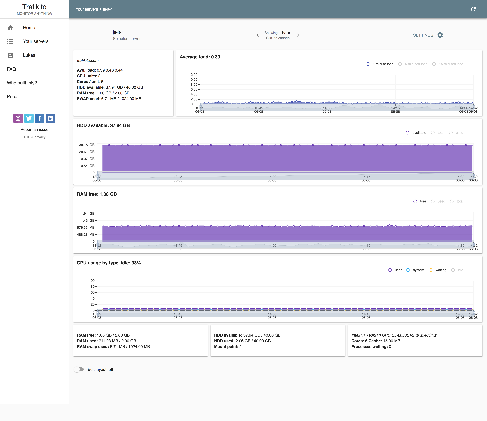

Weeks has flown by and a lot has been done. The most visible updates were changes for the color palette, many text alignments and layout issues fixed. The User Interface (UI) is now faster than ever. Plus the build is smaller, loads faster, fewer re-paints etc.etc.

<!--more-->

### The Color Palette

The color palette was defaulted colors that were provided by ‘Material-UI’ library which is used to build all UI. So, you can clearly understand why this was the first adjustment that was made. Now, the color palette is more unique, which is a major plus for Branding.

### Text Alignment

Visual aesthetics are very important. Have you ever visited a site and the text was way too difficult to read? Well, that’s simply annoying. So, I ensured that the copy was clearer and shorter. Now, the text alignment looks better.

### Less Visual Noise

Numerous layout issues were fixed. Now, the overall user experience is better and it’s easier to find required options. Basically, there's less visual noise.

User Interface (UI)
-------------------

### All about the user experience.

UI is all about the user experience. It’s everything that users use to interact with software. Basically, it's all the visual elements, including text. The UI can be GUI (graphical user interface) or CLI (command line interface). Trafikito is using GUI on the web and is now faster than ever.

### The Build is Smaller & Loads are Faster

The size was 1.2MB but it was reduced by 500 KB and now it's 730 KB. Also, the initial load is faster for first-time visitors and there’s faster response on user interaction. Significantly there are fewer resources used to load the website (less CPU used from user's machine = better battery life for users).

### Re-Paints & Re-Flows

Re-Paints are part of the process to display elements on the UI. The re-paints and re-flows were both optimized on Trafikito, so all UI requires fewer resources from the user's machine. This means less battery drain on mobile devices. Check this answer explaining what is reflow and repaint: \[https://stackoverflow.com/a/2549317/1737158\](https://stackoverflow.com/a/2549317/1737158)

### The Installation View

The installation view was totally redesigned. At first, it was 3 steps but now it's only 1 step installation. Now, it's clearer, the loads are faster and there’s an option for other Linux machines. Lastly, the Installation process was updated, shebang in a shell script is more portable + fixed several minor issues. Also, I added extra caching to deliver agent faster and overall it’s simplified.

Back-End Optimizations
----------------------

These past few weeks, I started using Redis database more heavily to cache many things. After this was updated, the main database is receiving 40-60% fewer queries per minute, everything overall works faster and it requires less RAM & CPU.

Social Channels
---------------

Don’t use social media to impress people; use it to impact people. - Dave Willis

The final move was to introduce Trafikito to everybody and what better way to make an introduction than social media. So I created an [Instagram Profile](https://www.instagram.com/trafikito/), [YouTube channel](https://www.youtube.com/channel/UCofioaADtesyD75204ngeoQ), [Twitter account](https://twitter.com/trafikito), [Facebook page](https://www.facebook.com/Trafikito/), [Linked In company](https://www.linkedin.com/company/trafikito/). Now, Trafikito is all over the place. You can follow updates on your favorite platform.

Trafikito is all over the place now. You can follow updates on your favourite platform.

Conclusion
----------

In short, all these changes have made it more appealing to users. After all, people love beautiful finishes that are easy to use.