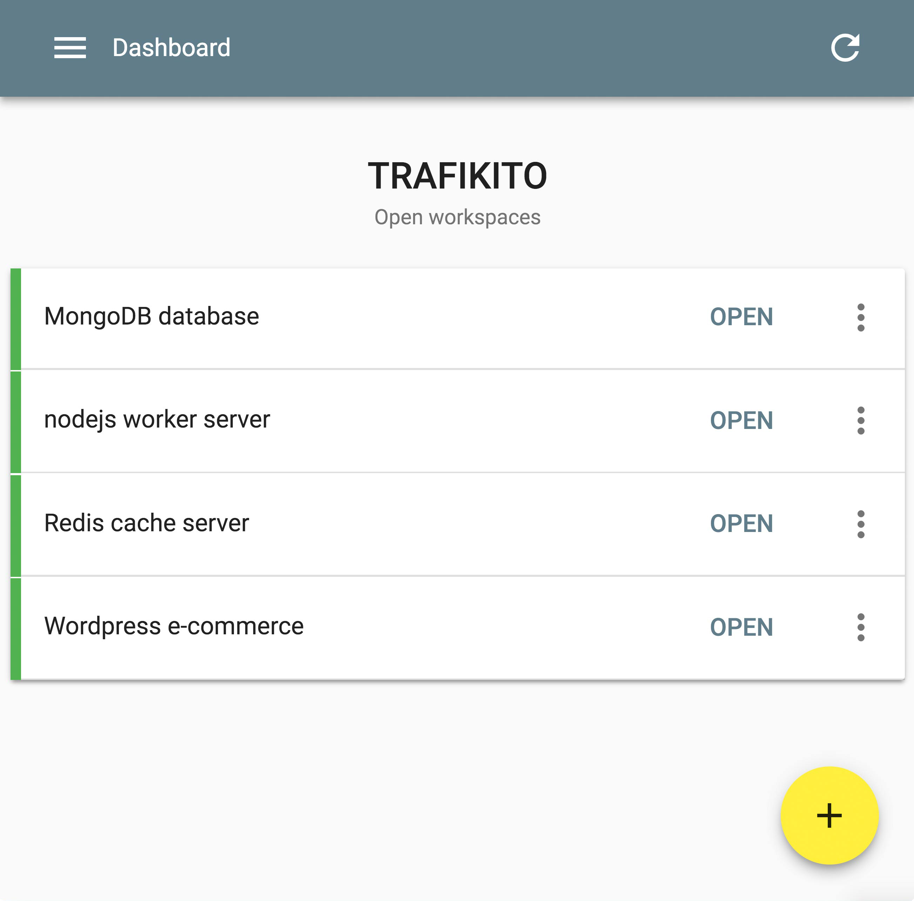
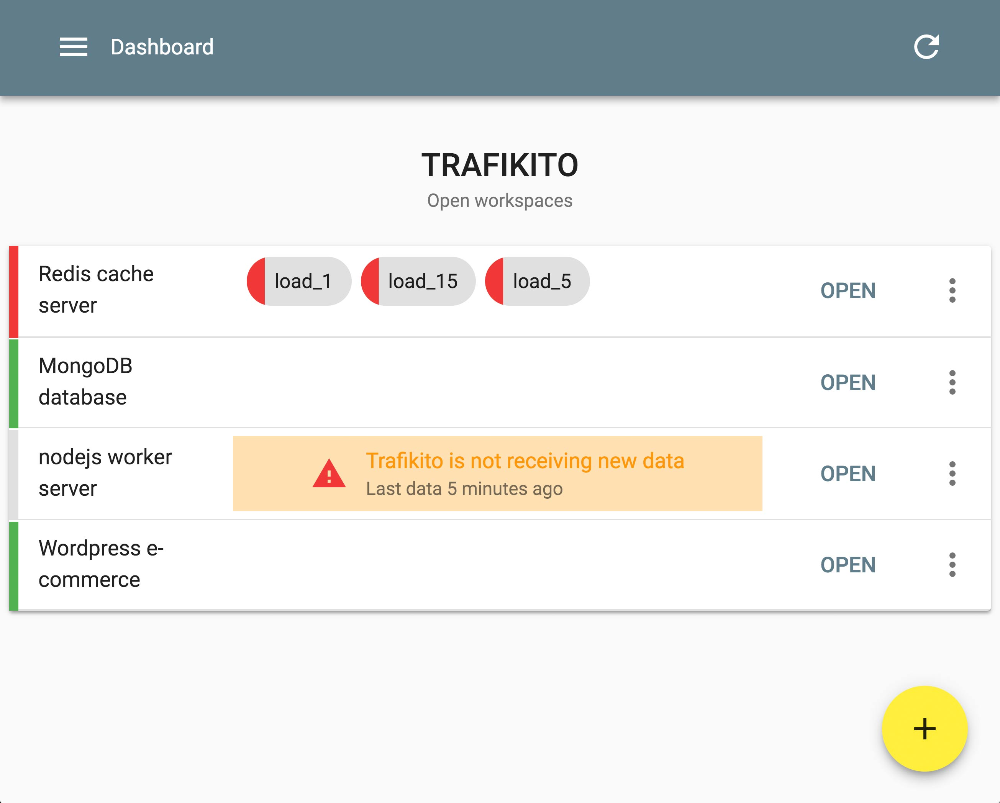
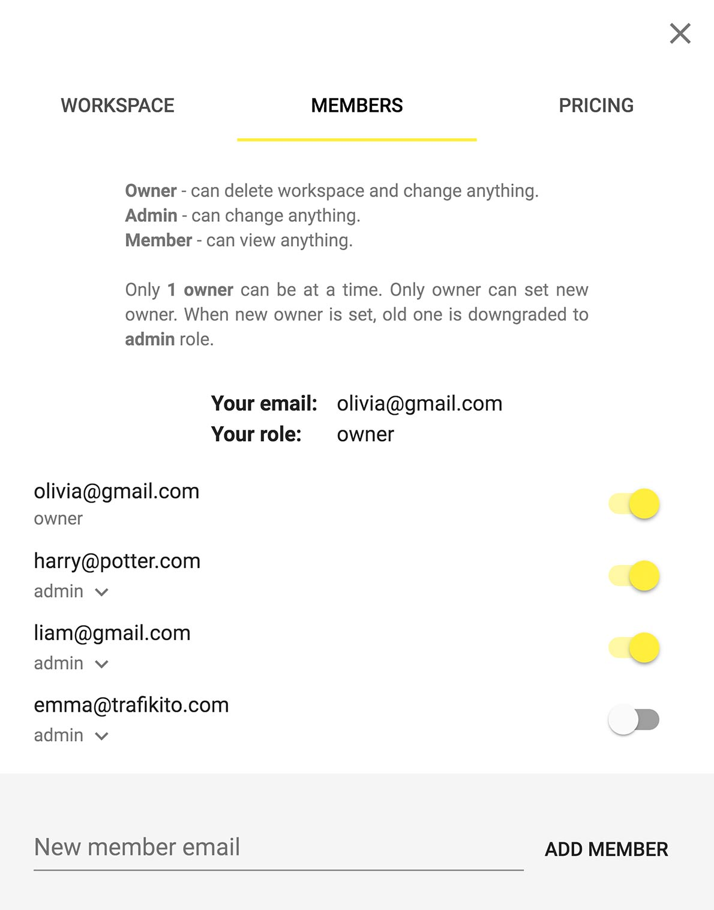

At Trafikito you can monitor several servers at once. Whether you have a database running on 3 servers, a web application on another, some caching on the next or maybe several projects and microservices running on different machines. The bottom line is **you need to monitor several different machines at once**. With Trafikito you can combine all servers in a single workspace and have a great overview of all your servers at once.

<!--more-->

A Workspace is like a container for several monitors. A single workspace contains:

1.  Servers to monitor
2.  Members

Servers Management
------------------

The Initial view of any workspace is your list of servers. In this list, you can see how all of your servers are doing. On the left, you can see the overall status and It may be:

1. <range-normal></range-normal> Everything's **ok**
2. <range-warn></range-warn> At least one monitored value is in the <range-warn>warning</range-warn> range
3. <range-error></range-error> At least one monitored value is in an <range-error>error</range-error> range

This list **refreshes automatically** per minute to ensure the overview is current.

Also, you have the option of adding more servers, viewing Trafikito installation instructions and removing a server. This is all done in the same clean list of servers in the selected workspace.

Members Management
------------------

The Free plan allows only one member in a workspace but with the paid plans you can add up to **30 members**. Also, you can be a member of several workspaces at once. After registering, you automatically get the default workspace but you can delete or make changes if you desire.

The User that creates a workspace automatically becomes the owner of it and any new user will have the role of a member.

